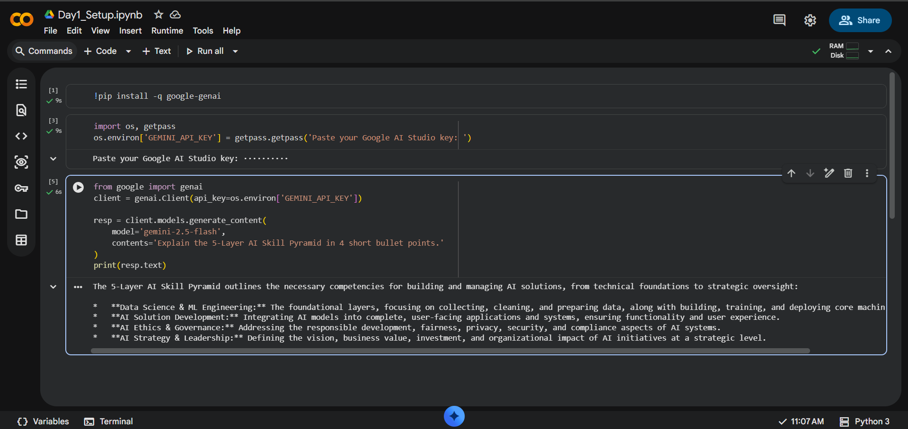

# AI Mentor Bootcamp — Marla Bharghav Sai

## Day 1 — Setup complete

- ✅ Google AI Studio API key provisioned
- ✅ Groq API key provisioned
- ✅ Hello-Gemini call working — see [Day1_Setup.ipynb](Day1_Setup.ipynb)
- 4-tool comparison matrix from Lab 1A: see screenshot below




## Day 2 Lab 2B — Errors handled

1. **Markdown fence wrapping** (` ```json ... ``` `)
   Gemini wraps output in fences despite `response_mime_type: application/json`.
   Handled by the retry prompt which asks Gemini to fix the malformed output.
   Triggers on ~5-10% of calls without `response_schema`.

2. **Hallucinated phone number when source has none**
   `Optional[str] = None` in the Pydantic schema allows Gemini to return `null`
   for missing phone fields. Without `Optional`, Pydantic raises ValidationError
   on every résumé that has no phone line.

3. **Empty / whitespace-only input**
   Input guard in `extract_resume` calls `Resume.model_validate({})` before
   hitting the API. Pydantic raises `ValidationError` with "Field required" for
   all missing fields. No API call is wasted. Caller catches cleanly.

## Sample résumés processed: 3 / 3 successful


## Day 4 — Productivity Sprint

Company: TCS

Time: 45 minutes

### Edit Notes

1. Gamma showed hiring 50,000 freshers. Source said 40,000. Edited.
2. Gamma listed Kubernetes as mandatory. Changed to optional.
3. Replaced generic cover title with TCS-specific title.
